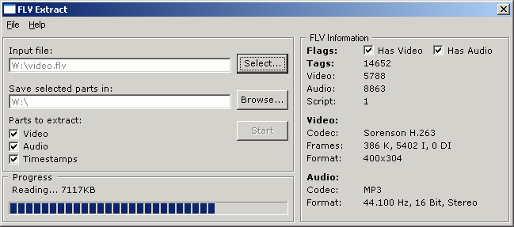



## FLV Extract

### Description

The application opens FLV (Flash Video) files and allows users to extract video, audio or timestamp information from them.

FLV Extract can currently extract MP3 audio stream and video encoded in Sorenson h263 (FLV1) format or On2 VP6 / On2 VP6 with Alpha Channel (FLV4).

The video is exported in the classic AVI format, allowing you to edit or view it with any player, if you have the correct video codecs installed on your computer.

At the moment I'm writing this, Video Lan Client has built-in support for all videos exported by FLV Extract and ffdShow, a Direct Show video codec for Windows and other operating systems, can be used to view the clips.

FLV Extract was inspired by another application written in C# available on Moitah.net which does the same thing but has a simpler interface and offers less feedback to the user. The author of the C# (original) version deserves credit for it, without that version I wouldn't have been motivated to port his version to Visual Basic 6 programming language and improve it.
 
### More Info
 

             |
---                |---
**Submitted On**   |2007-05-19 17:28:56
**By**             |[ Marius Hudea](https://github.com/Planet-Source-Code/PSCIndex/blob/master/ByAuthor/marius-hudea.md)
**Level**          |Advanced
**User Rating**    |5.0 (30 globes from 6 users)
**Compatibility**  |VB 6\.0
**Category**       |[Files/ File Controls/ Input/ Output](https://github.com/Planet-Source-Code/PSCIndex/blob/master/ByCategory/files-file-controls-input-output__1-3.md)
**World**          |[Visual Basic](https://github.com/Planet-Source-Code/PSCIndex/blob/master/ByWorld/visual-basic.md)
**Archive File**   |[FLV\_Extrac2067005222007\.zip](https://github.com/Planet-Source-Code/marius-hudea-flv-extract__1-68658/archive/master.zip)

